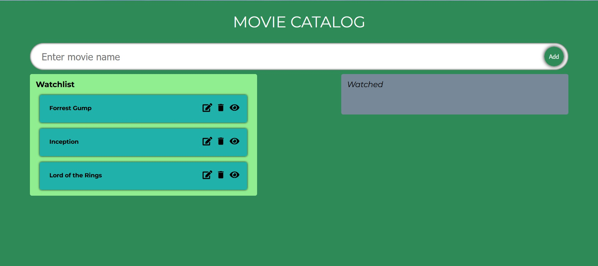

An app where you can add movies (movie names) to a list and edit and/or delete them. You can set the movie as watched which moves it to 'Watched' list. You can also move movies from one list to another by dragging and dropping them. 

To start the project, you can run: 

### `npm start`

Runs the app in the development mode.\
Open [http://localhost:3000](http://localhost:3000) to view it in the browser.
